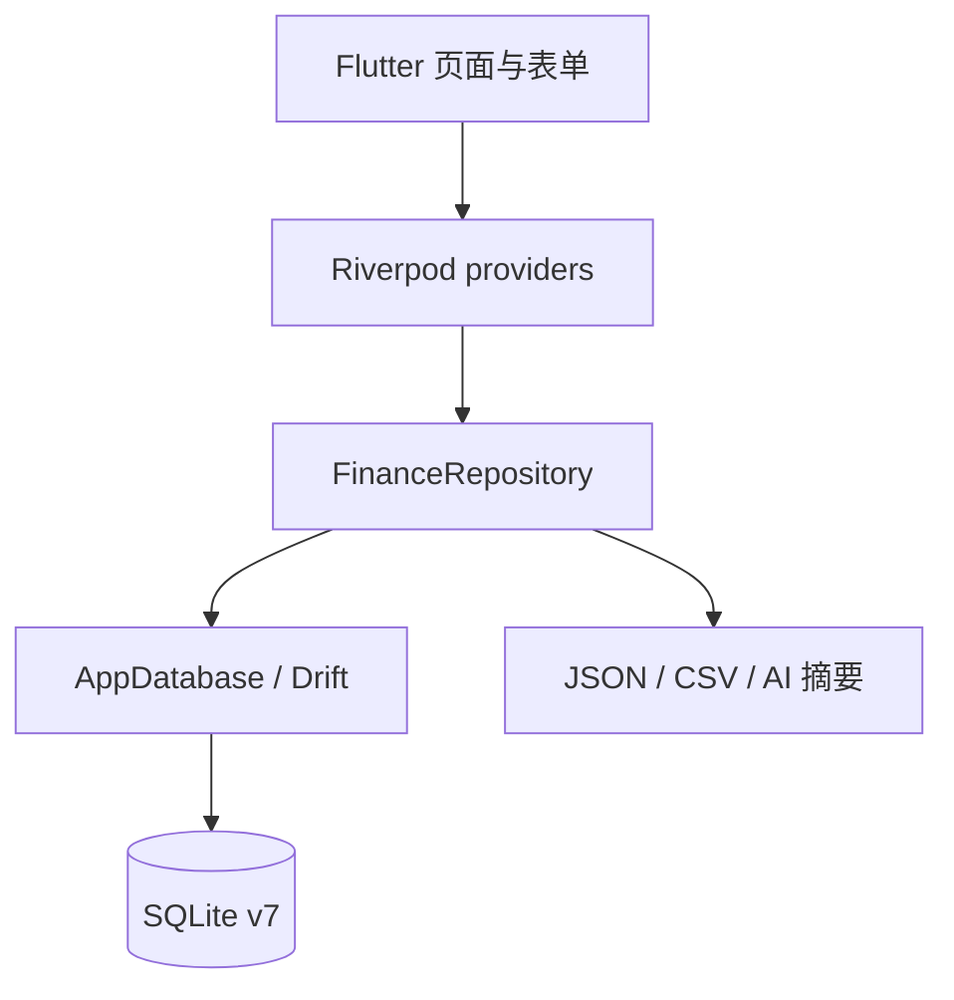

# Finance Compass 系统架构

## 技术栈

- Flutter 3 / Dart 3，Material 3
- Riverpod：数据库、Repository 和 mutation 状态传播
- Drift + SQLite：本地持久化，当前 schema 版本为 7
- `file_picker`、`file_saver`、`share_plus`：导入、导出与外部 AI 分享

## 运行结构

`HomeScreen` 提供总览、账户、交易、预算、报表和设置六个主入口。页面通过 `financeRepositoryProvider` 读取不可变快照，通过 mutation providers 执行写入；写入后重新载入 Repository，避免页面持有过期数据。

Repository 对信用卡提供两条明确分离的读取路径：账单、未出账和还款状态使用带日期截止的余额与交易快照；当前欠款、信用负债汇总和额度使用读取已影响物化余额的全部 `actual`/`settled`，从而包含未来已锁定额度的分期并排除 `planned`。周期规则保存的状态同样不由日期推导，生成器在所有月份原样继承该状态。

历史信用卡账期本身不是持久化快照，而是由 `availableCreditCardBillingPeriods` 根据账户结算日和最早相关交易按月派生。选择某期后，详情页使用该期 `CreditCardBillingPeriod` 过滤交易并计算原始账单金额；若用户已经提供银行结单完成对账，可在账户级 `app_meta` 保存按结算日索引的权威账单总额，展示时优先使用该值。权威总额只覆盖历史原始金额，不改变交易明细或实时承诺负债口径。

## UI 架构

- `finance_theme.dart` 提供 12 款主题、Material 组件默认值和 `FinanceThemeTokens`。共享组件通过 `ThemeExtension` 读取当前调色板，避免只改变页面背景而留下固定青色控件。
- `compass_ui.dart` 提供新版页面头部、卡片、图标徽章、设置行和悬浮操作按钮。
- `*_v2_screen.dart` 是 0.8.0 的主页面实现。
- 原 `TransactionsScreen`、`ReportsScreen` 和 `SettingsScreen` 仍作为高级筛选、详细报表和高级设置页使用；六个主入口采用紧凑的 v2 页面，避免在视觉重构中删除已有能力。
- 默认风格为 `abyss` 深海主题；用户可在外观页拖动预览其他风格，确认后写入设置。首次应用 0.8.0 视觉迁移时写入 `ui_redesign_v2_applied=true`。

## 数据升级

应用打开 v1–v6 数据库前会建立 `finance_compass_backups/pre_v7_*` 恢复点，包含 SQLite 文件、WAL/SHM（如存在）和逐表 JSON 快照。Drift 在事务内升级到 v7，随后执行 `quick_check` 与 `foreign_key_check`。备份失败会阻止升级，不会修改原数据库。

模板与周期规则由 `app_meta` JSON 迁入独立表。0.8.0 暂时双写新表和旧 JSON，支持回滚；读取时若新表为空，会回退旧 JSON。

## Android 构建变体

正式版使用应用 ID `com.financecompass.app` 和显示名称“Finance Compass”。Debug 版在 Gradle `debug` build type 中增加 `.debug` 后缀，最终应用 ID 为 `com.financecompass.app.debug`，显示名称为“Finance Compass Debug”。两个变体可以同时安装，并由 Android 分配互相隔离的数据目录；Debug 版不能覆盖或读取正式版本地数据。

## 已知边界

- Google 登录与云同步尚未实现；当前仅创建稳定的 `local_profile_id`。
- `loan` 目前是基础账户类别，尚无摊销计划、利率或自动拆分本金/利息功能。
- 通知偏好会保存，但系统级定时通知调度尚未实现。
