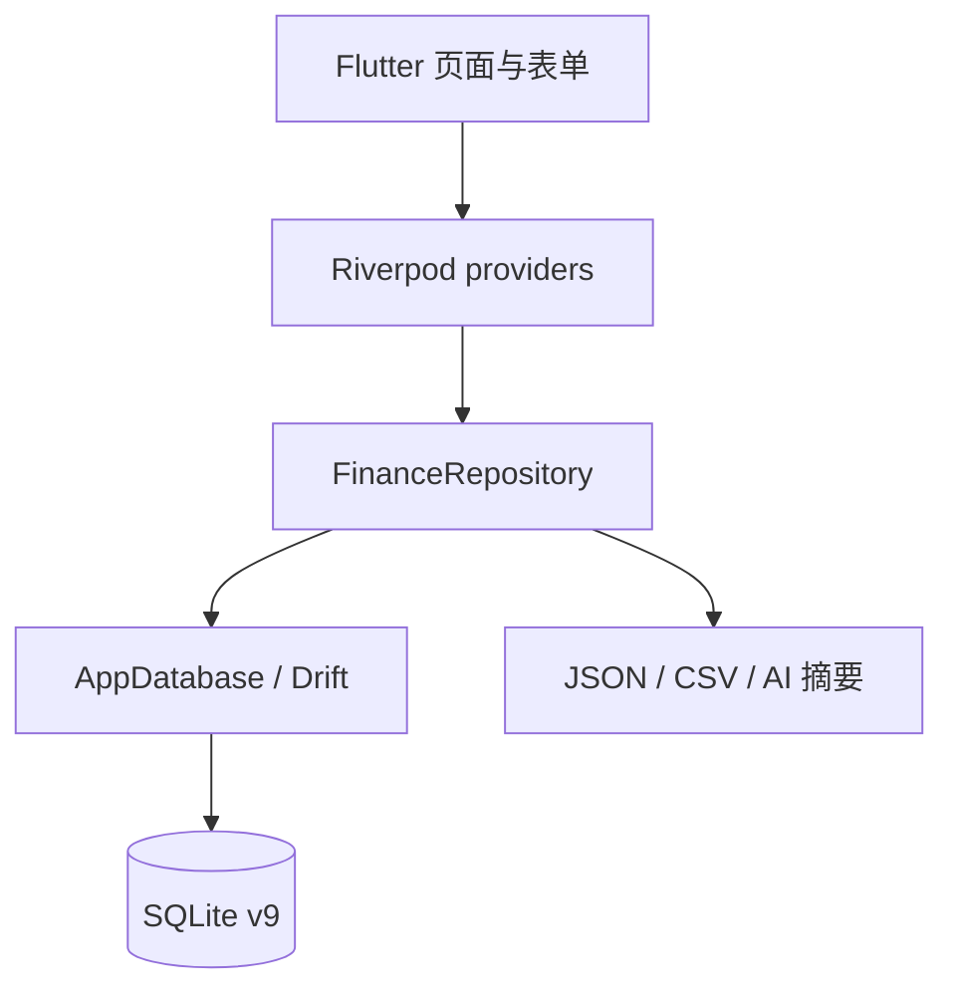

# Finance Compass 系统架构

公开分发层由 Flutter Android Release、Flutter Windows Release、Inno Setup 安装器和便携 ZIP 组成。`pubspec.yaml` 负责版本与静态支持二维码资产，Android Gradle 配置从被 Git 忽略的本机 `key.properties`/JKS 读取稳定发布签名，Windows CMake 输出 `FinanceCompass.exe`，`packaging/windows/FinanceCompass.iss` 只包装同一次 Windows Release 目录。GitHub Release 只接收二进制与校验文件，不接收数据库、JSON 备份或签名密钥。

## 技术栈

- Flutter 3 / Dart 3，Material 3
- Riverpod：数据库、Repository 和 mutation 状态传播
- Drift + SQLite：本地持久化，当前 schema 版本为 9
- `file_picker`、`share_plus`：导入、导出与外部 AI 分享

## 运行结构

`HomeScreen` 提供总览、账户、交易、预算、报表和设置六个主入口。页面通过 `financeRepositoryProvider` 读取不可变快照，通过 mutation providers 执行写入；写入后重新载入 Repository，避免页面持有过期数据。

Repository 对报表提供实际现金读模型，只累计 `ReportGroup.cash` 两端增减。报表总览、详细趋势、现金流出分析、历史平均和未来预测共用该读模型；预算继续采用消费发生口径。这样信用消费和现金还款不会重复计入，结构化贷款月供也不会被目标本金入账抵消成利息差额。

交易页中间口径卡使用只读派生模型 `MonthlyFundingNeed` 回答所选月份需要准备多少现金，取代旧现金收付净额卡而不再建立第二张独立大卡。Repository 先复用实际现金读模型取得已知流出，再按信用卡还款日与贷款摊销计划找出当月到期义务，并以对应还款交易计算覆盖额；总额只加入未覆盖部分，因此已有实际或预计还款不会重复计算。该模型是全月规划指标，不接收交易页下方账户、类型或类别筛选。

Repository 对信用卡提供两条明确分离的读取路径：账单、未出账和还款状态使用带日期截止的余额与交易快照；当前欠款、信用负债汇总和额度使用读取已影响物化余额的全部 `actual`/`settled`，从而包含未来已锁定额度的分期并排除 `planned`。周期规则保存后由 Repository 自动展开未来 3 个完整日历月，生成器只处理今天之后的发生日并统一写入 `planned`，因此不会提前改变真实余额；规则管理可继续补齐更远月份且以月份键防重。

贷款计划采用派生模型：`Account` 分别保存合同开始日、开始记账日和合同条件，并以 `initial_balance` 保存本账本开始追踪时的贷款余额。`loan_amortization.dart` 以纯函数生成 `LoanAmortizationSchedule`；当开始余额小于合同金额时，只派生开始记账日之后需要追踪的期数，不制造以前已经还款的交易。计划行不持久化为交易，避免编辑条件后留下成百上千笔过期预计记录。用户确认某期还款时，页面通过 transaction mutation 写入一笔结构化月供转账：`amount` 是现金账户扣除的完整月供，`to_amount` 是贷款账户减少的本金，差额为利息。旧版预计本金/利息组合由贷款详情页安全合并，实际历史记录不自动改写。

历史信用卡账期本身不是持久化快照，而是由 `availableCreditCardBillingPeriods` 根据账户结算日和最早相关交易按月派生。选择某期后，详情页使用该期 `CreditCardBillingPeriod` 过滤交易并计算原始账单金额；若用户已经提供银行结单完成对账，可在账户级 `app_meta` 保存按结算日索引的权威账单总额，展示时优先使用该值。权威总额只覆盖历史原始金额，不改变交易明细或实时承诺负债口径。

## UI 架构

- `finance_theme.dart` 提供 12 款主题、Material 组件默认值和 `FinanceThemeTokens`。共享组件通过 `ThemeExtension` 读取当前调色板，避免只改变页面背景而留下固定青色控件。
- `compass_ui.dart` 提供新版页面头部、卡片、图标徽章、设置行和悬浮操作按钮。
- `*_v2_screen.dart` 是 0.8.0 的主页面实现。
- 原 `TransactionsScreen`、`ReportsScreen` 和 `SettingsScreen` 仍作为高级筛选、详细报表和高级设置页使用；六个主入口采用紧凑的 v2 页面，避免在视觉重构中删除已有能力。
- 默认风格为 `abyss` 深海主题；用户可在外观页拖动预览其他风格，确认后写入设置。首次应用 0.8.0 视觉迁移时写入 `ui_redesign_v2_applied=true`。

## 数据升级

应用打开任何 v1–v8 数据库前会建立 `finance_compass_backups/pre_v9_*` 恢复点，包含 SQLite 文件、WAL/SHM（如存在）和逐表 JSON 快照。Drift 在事务内逐级升级到 v9，随后执行 `quick_check` 与 `foreign_key_check`。备份失败会阻止升级，不会修改原数据库。v8 增加可空贷款合同字段；v9 只增加可空 `loan_tracking_start_date`，旧贷款缺失时回退使用合同开始日，不猜测或改写余额。

模板与周期规则由 `app_meta` JSON 迁入独立表。0.8.0 暂时双写新表和旧 JSON，支持回滚；读取时若新表为空，会回退旧 JSON。

共享 `CompassSettingsRow` 以可空 `onTap` 区分导航行与信息行：无处理逻辑时不创建 `InkWell`、不显示箭头。`interaction_wiring_test.dart` 对全部 feature 源码执行静态门禁，阻止 `_noop`、空交互回调及没有附近真实处理器的方向性图标。货币显示和应用内提醒保存在 `app_meta`，Repository 重载后由主页面统一应用，不新增后台服务。

## Android 构建变体

正式版使用应用 ID `com.financecompass.app` 和显示名称“Finance Compass”。Debug 版在 Gradle `debug` build type 中增加 `.debug` 后缀，最终应用 ID 为 `com.financecompass.app.debug`，显示名称为“Finance Compass Debug”。两个变体可以同时安装，并由 Android 分配互相隔离的数据目录；Debug 版不能覆盖或读取正式版本地数据。

## 已知边界

- Google 登录与云同步尚未实现；当前仅创建稳定的 `local_profile_id`。
- 贷款计划当前使用固定合同利率；浮动利率重定价、手续费、罚息、部分还款和提前还款重算尚未实现。
- 通知偏好会保存，但系统级定时通知调度尚未实现。
