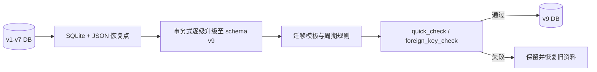
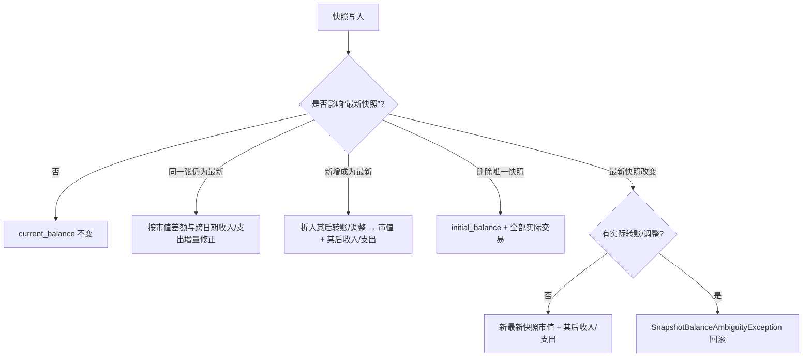

# 数据设计与迁移

## 平台存储边界

`AppDatabase` 的 schema 与 JSON 格式在原生和 Web 保持一致，但物理保留位置不同：Android/Windows/macOS/Linux 使用应用私有 SQLite 文件；Web 使用 Drift WASM SQLite 的浏览器 OPFS/IndexedDB。Web 数据键为 `finance_compass.sqlite`，作用域是当前 origin 与浏览器 profile，而非 Docker 主机。自托管容器没有可备份的服务端账本卷；每个浏览器使用完整 JSON 导出进行可携备份和恢复。

Web 不承诺 OPFS/IndexedDB 在清除网站数据、无痕模式结束、浏览器存储配额清理、切换域名/端口或设备丢失后仍存在。任何涉及升级、迁移或导入覆盖的操作前应下载 JSON；导入验证和 Drift 事务仍沿用本文件定义的数据一致性规则。

## v9 实体

- `accounts`：保留 v7 的信用卡字段；v8 新增可空的 `loan_principal`、`loan_annual_interest_rate`、`loan_term_months`、`loan_start_date`、`loan_payment_day`、`loan_repayment_method`、`loan_quoted_monthly_payment`；v9 新增可空 `loan_tracking_start_date`，把中途建账日期与真实合同开始日分开。
- `categories`：新增 `icon_key`、`color_value`、`sort_order`、`is_archived`。
- `transaction_templates`：保存模板的账户、分类、金额、币种、状态、转账和显示顺序字段。拖动排序后，全部模板按当前界面顺序重写为从 `0` 开始且连续唯一的 `sort_order`；前五项由查询排序直接确定，不另建“置顶”副本。
- `recurring_transaction_rules`：保存周期、开始/结束日期、已生成月份和启用状态。
- 原有 `budgets`、`transactions`、`asset_snapshots`、`app_meta` 保留主键和数据。

`accounts.account_type` 是文本枚举，0.8.0 增加 `loan`；贷款归入 `ReportGroup.credit`。`loan_repayment_method` 允许 `equalInstallment`、`equalPrincipal`、`flatRate`。银行核定的常规月供适用于 `equalInstallment` 和 `flatRate`，不适用于每期本金固定而月供递减的 `equalPrincipal`。旧账户不会自动变更类型，旧贷款的新增字段保持 `NULL`，进入详情时提示完成条件。

## 迁移流程

迁移不会重算 `current_balance`、给旧信用卡猜测额度/账单日期，或给旧贷款猜测金额、利率和年限。旧版信用卡交易曾以 `record_date` 保存发生日期、以 `transaction_date` 保存单笔结算日期；一次性迁移 `credit_card_account_billing_dates_v1` 会把涉及信用卡且两者不同的 `transaction_date` 改为 `record_date`。金额、账户、分类、状态和非信用卡交易日期保持不变。信用卡编辑表单会对空字段显示额度 `10000`、结算日 `12`、还款日 `28` 的建议值，但打开页面不会写库；用户通过校验并保存后才更新对应账户。模板与规则保留原 ID。`local_profile_id` 是未来身份绑定锚点，不代表已启用云同步。

## 贷款计划派生与还款落账

贷款还款计划不设独立表。`loan_principal` 保存原合同金额，`loan_start_date` 保存真实合同开始日，`loan_tracking_start_date` 保存本账本开始追踪的截止日；负数 `initial_balance` 保存该截止日的开始记账余额，`current_balance` 保存扣除建账后本金还款的当前余额。开始余额小于合同金额即表示中途建账，不建立过去期数或历史交易。`calculateLoanAmortization` 以合同条件和可选 `openingPrincipal` 为输入，按分币四舍五入生成待追踪 `LoanInstallment` 列表；每项包含 `number`、`dueDate`、`payment`、`principal`、`interest`、`remainingPrincipal`。末期始终调整尾差，使剩余本金为零。等额本息按月余额计算利息；等额本金沿用原合同固定本金；平息贷款沿用原合同金额推导的月息，银行核定月供扣除该月息后用于冲减开始余额。

用户选择生成预计还款时，每个尚未记录期数写入一笔状态为 `planned` 的结构化 `transfer`：`amount` 保存完整月供，`to_amount` 保存本金，说明为 `贷款月供 #<期数>`，发生日为该期到期日，且预计状态不改变物化余额。重复生成以贷款目标账户、期号和 `planned` 状态跳过已有计划。记录实际还款时先删除同一来源账户、到期日和期号的预计记录，再写入同结构的实际月供；现金账户减少完整 `amount`，贷款账户只按 `to_amount` 减少本金，差额为利息。打开贷款详情时只把可唯一匹配的旧版预计本金/利息组合合并为该结构；实际历史不自动改写。删除或修改实际交易后，余额和已记录状态从账本重新计算，不保存第二份状态。

## 预算生效规则

`budgets` 中同一类别可以有多个不同 `month_key` 的记录，每条记录代表从该月开始生效的规则，不是只属于单月的快照。查询目标月时，系统选择 `month_key <= target` 的最新一条；更晚规则不会影响更早月份。预算编辑器仅在类别和生效月份均未改变时复用原 ID，否则创建新 ID，保留旧规则。该行为不新增 schema 或迁移。

## 资产目标统计口径

资产目标继续存放于 `app_meta.asset_goals_json`，不新增字段或迁移。`assetGoalSummaries` 及目标页趋势调用 `totalAssetsAt(..., includeCredit: false)`，只汇总非 `ReportGroup.credit` 账户，因此信用卡和贷款负债不扣减目标金额；`totalAssetHistory` 的 `includeCredit` 默认为 `true`，保证净资产报表继续使用原口径，只有资产目标显式传入 `false`。旧版单一目标迁移后的默认名称为“资产目标”，目标金额保留；旧的首次达成日期在展示时不再直接采用，并在下次相关写入时按现有账本重算。

截止日与首次达成日期（`AssetGoal.reachedAt`，JSON 字段 `reached_at`）：

- `assetGoalSummaries({cutoffDate})` 经 `assetGoalCutoffDate` 把缺省或晚于今天的截止日钳制到今天 23:59:59.999；早于今天的截止日按原值使用。`currentAssets`、`history` 与 `isReached` 因此都不计入未来日期的实际交易或快照，`planned` 交易本来就不影响余额。
- `reachedAt` 每次从账本重算，不读取已存储值：只检查截止日前涉及非 credit 账户的实际交易日和快照日，按日终总资产找出首次 ≥ 目标金额的那一天，而不是月末。跨月中途达成记为当天，快照升值记为快照日。
- 最早事件日之前的余额（期初余额）已达标的目标无法确认日期，`reachedAt` 为空但 `isReached` 仍为真；从未达标的目标同样为空。曾达标后回落时 `reachedAt` 保留历史首次日期，`isReached` 按当前资产为假。
- Repository 的交易、快照、账户、汇率及导入等相关写入路径经 `_refreshWithGoalSync` 重算后写回 `asset_goals_json`；只改模板、规则或对账标记的路径不触发目标同步。删除或修改交易后已不成立的旧日期会被清除；即使尚未发生写入，页面摘要也从账本实时计算而不信任旧值。`AssetService` 镜像实现保持相同规则。
- 多币种历史总资产沿用现有 `convertToBase` 的当前汇率，不保存逐日历史汇率；修改汇率后，历史首次达成日期也可能随重算改变。当天尚未到时但被标记为 `actual` 的交易，按应用的日期口径计入当日日终。

## 投资快照与剩余成本

`asset_snapshots.cost_basis` 在首张快照中是该日的成本基线；新建首张快照时，表单以截至该日的实际投入减实际取出预填，用户可根据此前未录入的历史调整。后续累计成本为首张基线加首张快照之后的实际投入；剩余成本再扣首张快照之后的实际取出，最低为零。没有快照时，剩余成本为实际投入减实际取出。首张快照之前的取出已包含在基线中，不得重复扣除。未实现盈亏与比例均以同一截止日的总市值和剩余成本计算；报表跨账户汇总时先把每个账户的市值和剩余成本换算成主币种。`planned` 不计入实际投入或取出。该修正只重算展示值，不迁移或改写既有快照与交易；如历史基线本身录入错误，仍需由用户更正首张快照。

### 快照市值的折入语义与根本限制

`_syncInvestmentFlowIntoSnapshot` 在记录、编辑或删除实际 `transfer`/`adjustment` 时，把金额加到**当时日期最晚**的快照的 `market_value` 和 `cash_balance` 上，不论交易日期早于还是晚于该快照。`income`/`expense` 从不折入。系统**没有记录**每笔转账/调整被折入了哪一张快照：`asset_snapshots` 与 `transactions` 只有 `created_at`，交易编辑不会更新时间戳，导入时全部重置为导入时刻，而且精度只到秒，因此无法据此可靠推断。结果是：只要账户有实际转账或调整，**非最新**快照的市值中含有哪些资金流就无法从数据库推断。本次修复只处理不依赖这一信息的写入路径，其余路径改为明确拒绝，不猜测。

### 快照写入后的物化余额

`AppDatabase.insertAssetSnapshot`、`updateAssetSnapshot`、`deleteAssetSnapshot` 在同一数据库事务内处理 `accounts.current_balance`；拒绝时抛出 `SnapshotBalanceAmbiguityException`（消息为中文、面向用户），事务整体回滚，快照与余额均不变。`planned` 从不参与计算，也不触发拒绝。

| 操作 | 条件 | 结果 |
| --- | --- | --- |
| 新增 | 新快照日期不早于所有现有快照（成为最新） | 已存在、日期晚于该快照的实际转账/调整折入其 `market_value`/`cash_balance`（与之后新录入的转账相同规则）；`current_balance` = 该市值 + 日期晚于快照的实际收入/支出 |
| 新增 | 回溯日期（非最新） | 按录入值保存，`current_balance` 不变 |
| 编辑 | 编辑前后都是最新 | `current_balance` 增加市值差额，并按新旧日期之间的实际收入/支出修正（日期后移时，被移入快照之前的收入/支出扣除；前移时加回） |
| 编辑 | 编辑前后都不是最新 | `current_balance` 不变 |
| 编辑 | “最新快照”发生变化 | 账户有实际转账/调整时拒绝；否则以新的最新快照市值 + 其后实际收入/支出重建 |
| 编辑 | 改换 `account_id` | 以 `ArgumentError` 拒绝（界面本身不提供该操作） |
| 删除 | 非最新 | `current_balance` 不变 |
| 删除 | 唯一快照 | `current_balance` = `initial_balance` + 全部实际交易 |
| 删除 | 最新且仍有较早快照 | 账户有实际转账/调整时拒绝；否则以剩余最新快照市值 + 其后实际收入/支出重建 |

增量路径以当前的 `current_balance` 为基准，不会修复旧逻辑已经写错的值；本次不做数据迁移或批量重算。

### 快照之后的历史读取

`FinanceRepository.accountBalanceAt`、`accountBalanceTrace`，以及 `AccountService`、`AssetService` 中对应的读取，以截止日前最近一张快照为锚点：市值 + 快照之后到截止日的实际收入/支出 − 截止日之后已折入的实际转账/调整。截止日之后的收入/支出不扣减，因为它们从未计入快照市值。当锚点就是最新快照时，远期截止日的读取结果等于上表维护的 `current_balance`。当锚点是**非最新**快照时，“截止日之后的转账/调整已折入该快照”只对按时间顺序录入的数据成立；补录或旧数据可能使历史值偏差。这一点受上述根本限制约束，本次未改变。

### 首张快照之前的历史读取

账户已有快照、但截止日早于首张快照时，`accountBalanceAt`/`accountBalanceTrace` 从 `initial_balance` 正向累加截止日及之前的实际交易，不再以已包含未来快照的 `current_balance` 反推；`costBasisForAccount` 在该区间只返回截至当日的实际投入，不返回首张快照的 `cost_basis`。没有任何快照的账户仍由 `current_balance` 回退未来交易。以上变更均无 schema、迁移或备份格式变化。

### 完整修复所需的最小设计（尚未实现）

该设计仅为提案：新增关联表，例如 `snapshot_flow_folds(snapshot_id, transaction_id, amount)`，由 `_syncInvestmentFlowIntoSnapshot` 和新增快照时的折入逻辑写入，交易反转时按记录精确撤销。这样删除或重排最新快照时，可以把被删快照吸收的资金流准确转移到新的最新快照。已有数据没有这类记录，只能标记为“折入未知”，继续执行上述拒绝规则，或由用户逐户确认重建。这需要 schema 升级（v10）、导入导出格式扩展和迁移测试。

## 信用卡专用还款

信用卡专用还款流程只允许选择与信用账户同币种的 `ReportGroup.cash` 来源，确认后写入一笔 `actual transfer`。同币种还款以 `amount` 同时作为现金扣款和信用账户入账，`to_amount` 保持 `NULL`；它不新增消费支出，但按完整 `amount` 进入实际现金流出。

## 实际现金报表口径

报表页面由 `ReportsV2Screen` 直接读取派生数据，不新增表或迁移。旧详细报表的版块顺序曾写入 `app_meta.report_section_order_v2`；新版不再读取或修改该值，升级后旧值可留在本地，回滚至旧版时仍可使用。交易多选筛选只保存在页面状态，不写入账本或备份。

实际现金汇总是交易和账户分组的派生读模型，不新增字段。现金类账户收入为流入、支出为流出、调整按符号进入；转账分别检查来源和目标是否为 `ReportGroup.cash`。现金到信用卡或贷款的转账按来源完整 `amount` 形成现金流出，目标端本金/还款入账不与其抵消；现金到现金的两端在总现金层面相抵为零。信用账户消费在支付现金前不进入现金流。历史报表排除 `planned`，未来月份明确选择“包含预计”或预测时才纳入。

信用卡账期是运行时派生数据，不新增表或字段。`CreditCardBillingPeriod` 使用账户的 `statement_day`、`payment_due_day` 和当前完整日期计算 `cycleStartDate`、`statementDate`、`dueDate`、`nextStatementDate`；月底日号在短月份夹到月末。本期和未出账交易按已归一为发生日期的 `transaction_date` 完整年月日闭区间筛选，历史账期交易不得混入当前列表。`transfer.account_id` 为信用卡时，转出金额按该卡消费方向进入账单；`transfer.to_account_id` 为信用卡时，转入金额只作为该卡还款方向减少余额。信用卡 A 转至信用卡 B 因而只增加 A 的账单，同时减少 B 的负债，不在 B 重复生成消费。迁移后 `transaction_date` 只表达可编辑的发生日期；`record_date` 保留最初录入/旧版发生日期，因此用户后来修改发生日期时两者可以不同，但该差异不再代表单笔结算日期。

账单月份不新增快照表。`availableCreditCardBillingPeriods` 会先列出包含未来 `actual`/`settled` 的已确定账期，再列本期并向前逐月生成至最早相关实际交易，最多 120 期；历史中间无交易月份仍可显示为零账单。`calculateCreditCardBillingPeriodForStatement` 从所选结算日重建完整边界，`calculateCreditCardStatementAmount` 只汇总该边界内来源卡方向的实际流水并排除 `planned`；`calculateCreditCardOriginalStatementAmount` 在旧导入明细不完整时再用明确还款凭据补足原始账单额。修改交易后再次进入该月份会实时重算，不保存可能过期的账单副本。

`transactions.status` 的计算契约为：`planned` 不改变实际余额；`actual` 与兼容状态 `settled` 属于实际记录。数据库中的 `accounts.current_balance` 是为写入与回滚保留的物化值，可能包含未来日期的实际记录，因此普通账户、投资/退休和历史范围展示不得直接把它当作默认现状，而应通过 `accountBalanceAt(..., currentMonthCutoffDate())` 回退未来月份的实际变动。信用卡承诺负债是有意的例外：`creditCardCommittedOutstandingBalance` 从物化余额读取全部日期的 `actual`/`settled`，以包含已经锁定额度的未来分期；`planned` 因不影响物化余额而始终排除。信用卡本期账单、未出账、逾期与还款提醒仍使用截至今天的余额和交易列表，不能把未来承诺提前归入账期。预测改用截至今天的余额为基线，再读取预测窗口内的实际与预计记录，避免本月未来交易重复累计。

`recurring_transaction_rules.status` 是整条规则的生成契约，不由生成日期推导。规则为 `actual` 或 `settled` 时，未来月份仍生成相同实际状态；规则为 `planned` 时，当前及未来月份均生成 `planned`。新增交易的 1–12 月批量生成遵守相同规则，避免同一批记录首月和后续月份被静默拆成不同状态。

`transactions.amount` 与转账的 `to_amount` 是有限的有符号实数，不设正数约束。零金额是合法记录且不改变任何账户余额；负数按照交易类型的既有代数方向计算，例如负支出增加来源账户余额，负转账增加来源账户并减少目标账户。新增、更新和删除必须使用完全对称的正向/逆向规则。`NaN` 与正负无穷不是合法表单输入；该约束不改变 SQLite schema 或 JSON v3 字段类型。

普通同币种转账只使用一个权威金额：`amount` 同时代表来源扣款和目标入账，界面虽然显示只读转入金额，`to_amount` 保存为 `NULL`。结构化贷款月供是受控例外：`amount` 保存现金账户扣除的完整月供，`to_amount` 保存贷款余额减少的本金，两者差额是利息；说明使用 `贷款月供 #N`，编辑器必须保留两个金额。跨币种转账则把自动换算或用户校正后的实际到账数保存到 `to_amount`，目标账户按该值及 `to_currency` 入账；之后汇率设置变化不会反向改写历史交易。受影响的旧 Debug 版本可能由快速模板写入不可见的 `to_amount=0`，导致来源已扣款而目标未入账；一次性迁移 `zero_same_currency_transfer_amounts_v1` 会把非零、同币种、目标有效的普通转账归一为 `NULL`，并仅对 `actual`/`settled` 记录补回目标余额，`planned` 只归一字段而不影响余额。完整 JSON 导入会强制扫描同一异常，修复在替换数据与完整性检查的同一事务内完成，源 JSON 不会被覆盖。

本地账单对账修复优先使用可审计交易，不以孤立余额覆盖代替流水：缺失分期补为来源信用账户的 `actual` 支出，已确定未来分期同样使用 `actual`，全额退款以原支出和同额负支出同时保留。若银行连续账单证明差额来自应用最早可用流水之前，且无法恢复商户级明细，可校正账户 `initial_balance`，同时重建 `current_balance` 并在 `app_meta` 保存日期、银行余额、差额、删除记录及来源文件；不得伪造当前账期消费。分期交易日期按账户结算日归入对应账单，商品原购买日期保留在说明或外部账单中。写入前必须创建一致性 SQLite 备份，写入后从期初余额、实际支出及转入还款重算物化余额，并执行完整性和外键检查。

## 账户统计截止

账户统计月份是临时 UI 状态，不新增表、字段或 `app_meta`。页面把月份换算为当月最后一刻，并通过 `accountBalanceAt`、资产快照和交易日期重建历史余额；只纳入截止日前的 `actual`/`settled`，排除 `planned`。返回本月会丢弃历史选择，现有物化余额、贷款计划、信用卡账期和备份格式均不变。

## 交易删除与余额一致性

`AppDatabase.deleteTransactionsByIds` 会先去重所选 ID，再在单一 Drift 事务中读取全部记录、逆向应用每笔记录对账户余额的影响，最后删除记录。收入、支出、调整和转账沿用新增交易的反向余额规则，转账同时恢复来源与目标账户；该对称规则同样覆盖零和负金额。若实际读取数量与所选 ID 数量不一致，则抛出 `StateError` 并回滚整批操作，避免部分删除或余额只恢复一半。空 ID 集合是无操作。该流程不改变 schema、备份格式或周期规则；删除规则生成的交易不会级联删除对应规则。

## 已确定账单派生口径

`availableCreditCardBillingPeriods` 先按结算日期升序列出由未来 `actual`/`settled` 记录形成的已确定账期，再列出本期，最后按倒序回溯历史账期，合计最多 120 期。未来 `planned` 不创建账期；账期仍是运行时派生数据，不新增表或快照。

`calculateCreditCardStatementAmount` 汇总账期内来源卡方向的实际消费、转出、退款和调整。`calculateCreditCardOriginalStatementAmount` 以该合计作为原始账单额；为兼容消费明细不完整的旧导入资料，它还汇总结算日至还款日之间转入该信用账户的实际还款，并取两者较大值作为可校对的原账单额。还款后该值保持不变。若用户提供银行结单完成对账，`app_meta` 以 `credit_card_statement_amounts_<account_id>_json` 保存 `{yyyy-MM-dd: amount}`；`FinanceRepository.creditCardStatementAmountOverride` 校验 JSON、有限非负金额及结算日键后返回权威快照，历史列表和所选账单详情优先使用该值。该 meta 随完整 v3 导出备份，但不改变交易、`initial_balance`、`current_balance` 或实时额度。`FinanceRepository.creditCardStatementBalance` 仍表示结算日账户余额，只能用于余额审计，不再作为账单月份金额或下期已使用额度。

当前“下期已使用额度”以 `calculateCreditCardStatementAmount` 的下一账期承诺额为上限。`calculateCreditCardBilling` 先用截至今天的实际欠款与截至今天的未出账净流水推导本期剩余应还；若存在明确转入信用卡的还款，并且其中一部分已经超过本期应还而抵扣未出账，则只扣除该可证明的超额部分。没有转入还款凭据时，即使旧资料的物化余额不完整，也不得反推并削减账期金额。该规则保留未来结算日前的 `actual` 承诺，同时保证已被还款覆盖的消费不重复显示。

`CreditCardBillingPeriod.billingMonthDate` 等于结算日前一天。该派生规则使每月 1 日结算的 8 月 1 日账期显示为 7 月账单，同时不改变 25 日等普通结算日的月份。下一期已使用额度以该账期的 `calculateCreditCardStatementAmount` 为基础，排除所有 `planned`，并只扣除有明确转入还款凭据的超额抵扣；它不读取跨期累计账户余额。

## 备份与恢复

完整导出格式为 v3，包含 `format_version`、`transaction_date_semantics=occurrence_date`、应用/schema 版本、账户（包括 v9 贷款条件）、分类、预算、交易、快照、模板、周期规则和可导出的 meta 设置。导入 v1/v2 时缺失字段使用 `NULL` 或安全默认值，并执行旧信用卡日期归一；v3 资料保留用户修改后的发生日期。旧 JSON 中的模板和规则会迁入新表。正式导入前自动导出当前 v3 恢复点。

交互偏好继续使用 `app_meta`，不改变 schema：`currency_symbol_style` 为 `symbol` 或 `code`，`number_separator_style` 为 `comma_dot` 或 `space_comma`，`notifications_enabled` 保存全局应用内提醒状态，`notification_preferences_json` 保存受支持提醒的布尔列表。系统级推送尚未实现，因此这些键只影响应用内总览提示。

完整导入先拒绝 0 KB、损坏、未知格式版本或字段类型错误的 JSON，再校验账户、类别、预算、交易、快照、模板与周期规则 ID 的唯一性和引用完整性。验证通过后才在数据库事务中替换所有受管表，并在提交前执行 SQLite `quick_check` 与 `foreign_key_check`；任一步失败都会回滚，原 repository 快照继续有效。模板的 `sort_order` 和周期规则的 `is_active` 会随 JSON 往返保留。导入旧 JSON 时，涉及信用卡的交易会在写入阶段把 `transaction_date` 归一为 `record_date`，因此旧单笔结算日期不会重新进入账期计算。自动恢复点保存在应用文档目录，不会覆盖用户选取的源文件。

## 保留与回滚

0.8.0 继续保留旧模板/规则 JSON 并双写，尚未执行移除旧键的后续迁移。schema v9 回滚时优先使用本次升级建立的 `finance_compass_backups/pre_v9_*` 数据库文件；更早版本的历史恢复点仍可能位于 `pre_v8_*` 或 `pre_v7_*`。也可使用自动生成的导入前 JSON，但旧应用不能保证保留新增贷款条件。
