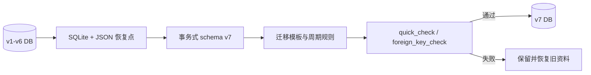

# 数据设计与迁移

## v7 实体

- `accounts`：新增 `credit_limit`、`statement_day`、`payment_due_day`；旧值均为 `NULL`。
- `categories`：新增 `icon_key`、`color_value`、`sort_order`、`is_archived`。
- `transaction_templates`：保存模板的账户、分类、金额、币种、状态、转账和显示顺序字段。拖动排序后，全部模板按当前界面顺序重写为从 `0` 开始且连续唯一的 `sort_order`；前五项由查询排序直接确定，不另建“置顶”副本。
- `recurring_transaction_rules`：保存周期、开始/结束日期、已生成月份和启用状态。
- 原有 `budgets`、`transactions`、`asset_snapshots`、`app_meta` 保留主键和数据。

`accounts.account_type` 是文本枚举，0.8.0 增加 `loan`；贷款归入 `ReportGroup.credit`。旧账户不会自动变更类型。

## 迁移流程

迁移不会重算 `current_balance` 或给旧信用卡猜测额度/账单日期。旧版信用卡交易曾以 `record_date` 保存发生日期、以 `transaction_date` 保存单笔结算日期；一次性迁移 `credit_card_account_billing_dates_v1` 会把涉及信用卡且两者不同的 `transaction_date` 改为 `record_date`。金额、账户、分类、状态和非信用卡交易日期保持不变。信用卡编辑表单会对空字段显示额度 `10000`、结算日 `12`、还款日 `28` 的建议值，但打开页面不会写库；用户通过校验并保存后才更新对应账户。模板与规则保留原 ID。`local_profile_id` 是未来身份绑定锚点，不代表已启用云同步。

信用卡账期是运行时派生数据，不新增表或字段。`CreditCardBillingPeriod` 使用账户的 `statement_day`、`payment_due_day` 和当前完整日期计算 `cycleStartDate`、`statementDate`、`dueDate`、`nextStatementDate`；月底日号在短月份夹到月末。本期和未出账交易按已归一为发生日期的 `transaction_date` 完整年月日闭区间筛选，历史账期交易不得混入当前列表。`transfer.account_id` 为信用卡时，转出金额按该卡消费方向进入账单；`transfer.to_account_id` 为信用卡时，转入金额只作为该卡还款方向减少余额。信用卡 A 转至信用卡 B 因而只增加 A 的账单，同时减少 B 的负债，不在 B 重复生成消费。迁移后 `transaction_date` 只表达可编辑的发生日期；`record_date` 保留最初录入/旧版发生日期，因此用户后来修改发生日期时两者可以不同，但该差异不再代表单笔结算日期。

账单月份不新增快照表。`availableCreditCardBillingPeriods` 会先列出包含未来 `actual`/`settled` 的已确定账期，再列本期并向前逐月生成至最早相关实际交易，最多 120 期；历史中间无交易月份仍可显示为零账单。`calculateCreditCardBillingPeriodForStatement` 从所选结算日重建完整边界，`calculateCreditCardStatementAmount` 只汇总该边界内来源卡方向的实际流水并排除 `planned`；`calculateCreditCardOriginalStatementAmount` 在旧导入明细不完整时再用明确还款凭据补足原始账单额。修改交易后再次进入该月份会实时重算，不保存可能过期的账单副本。

`transactions.status` 的计算契约为：`planned` 不改变实际余额；`actual` 与兼容状态 `settled` 属于实际记录。数据库中的 `accounts.current_balance` 是为写入与回滚保留的物化值，可能包含未来日期的实际记录，因此普通账户、投资/退休和历史范围展示不得直接把它当作默认现状，而应通过 `accountBalanceAt(..., currentMonthCutoffDate())` 回退未来月份的实际变动。信用卡承诺负债是有意的例外：`creditCardCommittedOutstandingBalance` 从物化余额读取全部日期的 `actual`/`settled`，以包含已经锁定额度的未来分期；`planned` 因不影响物化余额而始终排除。信用卡本期账单、未出账、逾期与还款提醒仍使用截至今天的余额和交易列表，不能把未来承诺提前归入账期。预测改用截至今天的余额为基线，再读取预测窗口内的实际与预计记录，避免本月未来交易重复累计。

`recurring_transaction_rules.status` 是整条规则的生成契约，不由生成日期推导。规则为 `actual` 或 `settled` 时，未来月份仍生成相同实际状态；规则为 `planned` 时，当前及未来月份均生成 `planned`。新增交易的 1–12 月批量生成遵守相同规则，避免同一批记录首月和后续月份被静默拆成不同状态。

`transactions.amount` 与转账的 `to_amount` 是有限的有符号实数，不设正数约束。零金额是合法记录且不改变任何账户余额；负数按照交易类型的既有代数方向计算，例如负支出增加来源账户余额，负转账增加来源账户并减少目标账户。新增、更新和删除必须使用完全对称的正向/逆向规则。`NaN` 与正负无穷不是合法表单输入；该约束不改变 SQLite schema 或 JSON v3 字段类型。

本地账单对账修复优先使用可审计交易，不以孤立余额覆盖代替流水：缺失分期补为来源信用账户的 `actual` 支出，已确定未来分期同样使用 `actual`，全额退款以原支出和同额负支出同时保留。若银行连续账单证明差额来自应用最早可用流水之前，且无法恢复商户级明细，可校正账户 `initial_balance`，同时重建 `current_balance` 并在 `app_meta` 保存日期、银行余额、差额、删除记录及来源文件；不得伪造当前账期消费。分期交易日期按账户结算日归入对应账单，商品原购买日期保留在说明或外部账单中。写入前必须创建一致性 SQLite 备份，写入后从期初余额、实际支出及转入还款重算物化余额，并执行完整性和外键检查。

## 交易删除与余额一致性

`AppDatabase.deleteTransactionsByIds` 会先去重所选 ID，再在单一 Drift 事务中读取全部记录、逆向应用每笔记录对账户余额的影响，最后删除记录。收入、支出、调整和转账沿用新增交易的反向余额规则，转账同时恢复来源与目标账户；该对称规则同样覆盖零和负金额。若实际读取数量与所选 ID 数量不一致，则抛出 `StateError` 并回滚整批操作，避免部分删除或余额只恢复一半。空 ID 集合是无操作。该流程不改变 schema、备份格式或周期规则；删除规则生成的交易不会级联删除对应规则。

## 已确定账单派生口径

`availableCreditCardBillingPeriods` 先按结算日期升序列出由未来 `actual`/`settled` 记录形成的已确定账期，再列出本期，最后按倒序回溯历史账期，合计最多 120 期。未来 `planned` 不创建账期；账期仍是运行时派生数据，不新增表或快照。

`calculateCreditCardStatementAmount` 汇总账期内来源卡方向的实际消费、转出、退款和调整。`calculateCreditCardOriginalStatementAmount` 以该合计作为原始账单额；为兼容消费明细不完整的旧导入资料，它还汇总结算日至还款日之间转入该信用账户的实际还款，并取两者较大值作为可校对的原账单额。还款后该值保持不变。若用户提供银行结单完成对账，`app_meta` 以 `credit_card_statement_amounts_<account_id>_json` 保存 `{yyyy-MM-dd: amount}`；`FinanceRepository.creditCardStatementAmountOverride` 校验 JSON、有限非负金额及结算日键后返回权威快照，历史列表和所选账单详情优先使用该值。该 meta 随完整 v3 导出备份，但不改变交易、`initial_balance`、`current_balance` 或实时额度。`FinanceRepository.creditCardStatementBalance` 仍表示结算日账户余额，只能用于余额审计，不再作为账单月份金额或下期已使用额度。

当前“下期已使用额度”以 `calculateCreditCardStatementAmount` 的下一账期承诺额为上限。`calculateCreditCardBilling` 先用截至今天的实际欠款与截至今天的未出账净流水推导本期剩余应还；若存在明确转入信用卡的还款，并且其中一部分已经超过本期应还而抵扣未出账，则只扣除该可证明的超额部分。没有转入还款凭据时，即使旧资料的物化余额不完整，也不得反推并削减账期金额。该规则保留未来结算日前的 `actual` 承诺，同时保证已被还款覆盖的消费不重复显示。

`CreditCardBillingPeriod.billingMonthDate` 等于结算日前一天。该派生规则使每月 1 日结算的 8 月 1 日账期显示为 7 月账单，同时不改变 25 日等普通结算日的月份。下一期已使用额度以该账期的 `calculateCreditCardStatementAmount` 为基础，排除所有 `planned`，并只扣除有明确转入还款凭据的超额抵扣；它不读取跨期累计账户余额。

## 备份与恢复

完整导出格式为 v3，包含 `format_version`、`transaction_date_semantics=occurrence_date`、应用/schema 版本、账户、分类、预算、交易、快照、模板、周期规则和可导出的 meta 设置。导入 v1/v2 时缺失字段使用 `NULL` 或安全默认值，并执行旧信用卡日期归一；v3 资料保留用户修改后的发生日期。旧 JSON 中的模板和规则会迁入新表。正式导入前自动导出当前 v3 恢复点。

完整导入先拒绝 0 KB、损坏、未知格式版本或字段类型错误的 JSON，再校验账户、类别、预算、交易、快照、模板与周期规则 ID 的唯一性和引用完整性。验证通过后才在数据库事务中替换所有受管表，并在提交前执行 SQLite `quick_check` 与 `foreign_key_check`；任一步失败都会回滚，原 repository 快照继续有效。模板的 `sort_order` 和周期规则的 `is_active` 会随 JSON 往返保留。导入旧 JSON 时，涉及信用卡的交易会在写入阶段把 `transaction_date` 归一为 `record_date`，因此旧单笔结算日期不会重新进入账期计算。自动恢复点保存在应用文档目录，不会覆盖用户选取的源文件。

## 保留与回滚

0.8.0 保留旧模板/规则 JSON 并双写。确认 v7 稳定至少一个发布周期后，才可在后续迁移提案中移除旧键。回滚时使用 `finance_compass_backups/pre_v7_*` 中的数据库文件，或导入自动生成的导入前 JSON。
