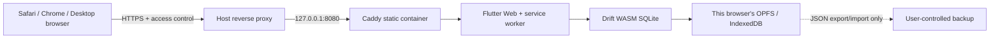

# 自托管 Web / PWA

## 当前实现与边界

Finance Compass `0.9.1+43` 可构建为自托管的 Flutter Web 应用。自托管服务器只分发 HTML、JavaScript、静态资源、`sqlite3.wasm` 与 Drift Worker；**没有后端 API、用户账户、服务端 SQLite、服务端备份或跨设备同步**。因此它适合让 iPhone、iPad、Android 和桌面浏览器访问同一私有网址，但不是云同步服务。

公开发布包：

- [Ubuntu v0.9.1](https://github.com/lawpowen/finance-compass-app/releases/download/v0.9.1/FinanceCompass-SelfHost-Ubuntu-v0.9.1.zip)
- [Windows v0.9.1](https://github.com/lawpowen/finance-compass-app/releases/download/v0.9.1/FinanceCompass-SelfHost-Windows-v0.9.1.zip)
- [macOS v0.9.1](https://github.com/lawpowen/finance-compass-app/releases/download/v0.9.1/FinanceCompass-SelfHost-macOS-v0.9.1.zip)

账本由 Drift WASM SQLite 保存在访问该网址的浏览器 profile 内。现代浏览器优先使用 OPFS，较旧/Safari 能力受限时可回退 IndexedDB。每一个“设备 + 浏览器 + 网站 origin”是一个独立账本：换设备、换浏览器或改变域名/端口都不会带来数据；清除该网站数据、无痕模式回收或浏览器存储被系统清理时可能丢失。使用前及每次重要录入后都应从“导入与导出”下载完整 JSON。



## PWA 与 Apple/Android 使用方式

- **iOS/iPadOS Safari**：通过 HTTPS 打开站点，点击分享按钮，再选择“添加到主屏幕”。Safari 不提供 Chromium 式安装提示；离线缓存与本地存储受 iOS 存储回收策略影响，所以不应以它代替 JSON 备份。
- **Android Chrome**：通过 HTTPS 打开站点，在 Chrome 菜单选择“安装应用”或“添加到主屏幕”。manifest 和 standalone display 已配置；Service Worker 会缓存静态应用外壳，首次完整加载后可离线打开。它不会让服务器持有或同步账本。
- **桌面浏览器**：支持作为普通网页或浏览器安装的 PWA 使用。浏览器 WebAssembly、Worker、IndexedDB/OPFS 被禁用时，应用会无法可靠保存资料，不应继续记账。

HTTPS 是 PWA、Service Worker 及受保护浏览器存储的前提（`localhost` 仅作开发例外）。不要把 HTTP 站点当作私人账本服务。

## 默认安全部署

`deploy/selfhost/compose.yml` 默认仅发布 `127.0.0.1:8080`，不会监听公网。先在 Ubuntu、Windows 或 macOS 安装 Docker Engine/Desktop，再在仓库根目录执行：

```powershell
.\deploy\selfhost\install.ps1
```

```sh
chmod +x deploy/selfhost/install.sh deploy/selfhost/install.command
./deploy/selfhost/install.sh
```

上述脚本构建并启动静态 Caddy 容器。确认本机 `http://127.0.0.1:8080` 可打开后，才可使用你自己控制的反向代理或 VPN 将其提供给其他设备。

面向 Internet 的部署必须至少做到：

1. 使用 DNS 域名、有效 TLS 证书并强制 HTTPS；不要直接把容器 8080 端口暴露到公网。
2. 在反向代理层启用访问控制。`deploy/selfhost/Caddyfile.reverse-proxy.example` 提供 Caddy Basic Auth 模板；使用 `caddy hash-password --algorithm bcrypt --plaintext '强随机口令'` 生成哈希，把用户名/哈希以受保护环境变量提供给 Caddy。
3. 为每个家庭成员或用户使用独立访问凭据；Basic Auth 只是在 TLS 内的入口保护，不能替代端点安全。
4. 定期更新 Docker 基础镜像、Caddy、Flutter 发行版本及宿主机安全补丁，并限制服务器管理权限。
5. 不把 JSON、SQLite、密钥、反向代理环境文件或日志上传到公开 GitHub Release。服务本身不写用户数据，备份责任在每个浏览器用户。

容器设置为只读、无 Linux capabilities、禁止新增权限且只有临时 `/tmp`。Caddy 同时加入基本的 CSP、无嗅探、拒绝嵌入与关闭支付/相机/麦克风等权限；这些头不是认证的替代品。

## 构建与交付

开发机上构建 Web：

```powershell
.\tool\build_web.ps1 -Flutter C:\Users\pwlaw\tools\flutter\bin\flutter.bat -Dart C:\Users\pwlaw\tools\flutter\bin\dart.bat
```

```sh
chmod +x tool/build_web.sh
./tool/build_web.sh
```

脚本先校验 `pubspec.lock` 的 sqlite3 版本、`web/sqlite3.wasm` 与 `tool/sqlite3_wasm.lock` 三者一致，再编译 `tool/drift_worker.dart` 到发布用 `drift_worker.js`，最后以 `--no-web-resources-cdn` 运行 `flutter build web --release`，使 CanvasKit 完全随自托管站点提供。当前锁定的 WASM 是 `sqlite3 2.9.4`：来源为 [sqlite3.dart `sqlite3-2.9.4` release](https://github.com/simolus3/sqlite3.dart/releases/download/sqlite3-2.9.4/sqlite3.wasm)，大小 `730,989` bytes，SHA-256 为 `922A76B182B6AF69B030C8E2FDD3283ECC8E827248B20E4B1F3F3DB170B52117`。不要使用“latest”资产；它可能与锁定 Dart bindings 的 WASM imports 不兼容并导致浏览器白屏。升级 sqlite3 时，必须一并审阅 `pubspec.lock`、lock 文件、官方 release asset 和真浏览器启动测试。

两个脚本（以及 `deploy/selfhost/Dockerfile`，它直接运行 `tool/build_web.sh`）执行同一份交付契约：

- **物理路径 + 空输出目录**：PowerShell 版先解析仓库路径中的 junction/符号链接，shell 版使用 `pwd -P`，然后删除整个 `build/web` 再构建。原因：Flutter 以路径字符串记录输出，并在 `build/web/.last_build_id` 指向另一套构建配置（配置哈希包含项目路径）时删除旧配置 `outputs.json` 中列出的文件。经由 junction（例如 `C:\Users\<user>\Documents\Codex` → `D:\Codex\Projects`）与物理路径交替构建，会让 Flutter 在打印 `Built build\web` 之后删掉刚写入的 `main.dart.js`、`flutter_bootstrap.js`、`assets/`、`canvaskit/` 及全部复制的 `web/` 文件。
- **失败不留半成品**：构建或任何检查失败时脚本删除 `build/web`，`package_selfhost.ps1 -SkipWebBuild` 因而不会打包残缺目录。
- **必需文件与预缓存**：检查 index、`flutter_bootstrap.js`、`main.dart.js`、manifest、`service-worker.js`、`pwa_bootstrap.js`、`sqlite3.wasm`、`drift_worker.js`、`version.json`、图标、Flutter 资源及全部 CanvasKit 变体（含 Chrome/Edge 实际加载的 `canvaskit/chromium/`）；再解析 `service-worker.js` 的 `CORE` 列表，逐项确认 `build/web` 存在对应文件。任一缺失都会让 `cache.addAll()` 整体失败，PWA 就不会安装离线外壳。
- **锁定资产**：`build/web/sqlite3.wasm` 再次对照 `tool/sqlite3_wasm.lock`；`build/web/drift_worker.js` 必须与刚编译的 `web/drift_worker.js` 相同；`fonts/` 下每个字体必须匹配 `web/fonts/SHA256SUMS`（见下文）。
- **无调试与构建 sidecar**：删除并拒绝 `drift_worker.dart`、`*.deps`、`*.map`、CanvasKit 的 `*.symbols`（运行时不加载，约 9 MB）以及 Flutter 构建簿记文件 `.last_build_id`。
- **CDN 与 bootstrap**：`flutter_bootstrap.js` 的构建配置必须含 `"useLocalCanvasKit":true`，且必须来自仓库的 `web/flutter_bootstrap.js` 模板。`flutter.js` 本身总会包含 gstatic CanvasKit URL，但只在未设置 `useLocalCanvasKit` 时使用；`main.dart.js` 中只允许出现引擎默认的字体回退地址 `https://fonts.gstatic.com/s/`，其他 gstatic 引用一律拒绝。

**Service Worker**：Flutter 3.44 仍会生成 `flutter_service_worker.js`，但内容只是“激活后注销自己并刷新页面”的清理存根。默认 bootstrap 在同一 scope 已有注册（即本站的 `service-worker.js`）时会改为注册这个存根，下一次访问就会注销离线外壳。因此仓库提供 `web/flutter_bootstrap.js` 模板，调用 `_flutter.loader.load()` 时不传 Service Worker 设置；存根仍随站点以 no-cache 提供但从不注册、也不预缓存。`web/service-worker.js` 是唯一的应用 Worker：安装时预缓存 `CORE` 中的 Flutter、CanvasKit、Drift/SQLite、图标字体、manifest、图标，以及 `fonts/SHA256SUMS` 列出的全部回退字体；它不缓存账本资料。`web/sqlite3.wasm` 必须随站点以 `application/wasm` 提供；`Caddyfile` 已显式处理该 MIME 类型。

**同源回退字体**：CanvasKit 不内置正文字体，默认从 `fonts.gstatic.com` 下载 Roboto 与 Noto Sans SC。本站 CSP（`connect-src 'self'`）会阻止该请求，离线时也无法访问，结果是整个界面没有文字（v0.9.0 自托管版即受此影响）。`web/fonts/` 按 gstatic 相同路径同源提供 Roboto（1 个文件）与 Noto Sans SC（101 个子集，合计约 2.4 MB），`web/flutter_bootstrap.js` 将 `fontFallbackBaseUrl` 设为 `fonts/`；两种字体均为 SIL OFL 1.1，许可文本随附于 `web/fonts/<family>/OFL.txt`。构建脚本会从 `main.dart.js` 提取 Roboto/Noto Sans SC 的全部回退 URL，任何一个未收录就失败，因此升级 Flutter 若改变字体版本会在构建时暴露，而不会发布无文字界面。更新方法：用新 SDK 构建后按失败信息列出的路径从 `https://fonts.gstatic.com/s/` 下载到 `web/fonts/` 同名路径，删除不再引用的旧文件，重新生成 `SHA256SUMS`（`sha256sum` 格式、小写十六进制、相对 `web/fonts/` 的 `/` 路径），并在真实浏览器与离线模式下复验文字渲染。引擎为其他字符选择的回退字体（例如 emoji、Noto Sans Symbols、日文/韩文/繁体中文字体家族）未收录：请求会被 CSP 拒绝，这些字符显示为缺字方框。

在 Windows Git Bash 中运行 `tool/build_web.sh` 时，MSYS 会把 `--base-href /` 改写为 Git 安装路径，需设置 `MSYS2_ARG_CONV_EXCL='*'`；Linux、macOS 与 Docker 不受影响。

创建跨平台自托管交付 ZIP：

```powershell
.\tool\package_selfhost.ps1 -Version 0.9.1
```

生成的 ZIP 内含 Dockerfile、Compose、Caddy 配置、Ubuntu/macOS shell 安装器与 Windows PowerShell 安装器。它不是 OS 原生 `.deb`、`.msi` 或 `.dmg`：三个系统均通过 Docker 提供相同、可复现的静态服务。不能从 Windows 对 macOS 签发可信 DMG，也不能声称未在目标 OS 构建的原生安装器已验证。

## 升级、回滚与恢复

- **升级 Web 壳**：先从每个设备导出 JSON，再拉取/解压新版本并运行 `docker compose up -d --build`。`web/service-worker.js` 采用缓存优先策略，每个发布版本都必须更换 `CACHE_NAME`（`0.9.1` 为 `finance-compass-shell-v0.9.1`），新 Worker 激活时才会删除旧的 `finance-compass-shell-*` 应用壳缓存；它不触碰 Drift 浏览器存储中的账本。浏览器首次刷新可能仍使用旧 Service Worker；关闭标签页后重新打开，必要时在浏览器开发者工具清除“应用缓存”，但先导出 JSON。
- **回滚 Web 壳**：部署旧镜像/源码即可；它不改变浏览器数据库 schema 之外的既有 Drift 迁移逻辑。若曾打开更高 schema，先按应用现有恢复策略导出 JSON，并确认旧应用能理解其格式。
- **恢复账本**：打开同一受保护 origin，在“导入与导出”选择此前下载的 JSON。Web 不能悄悄在服务器创建恢复点；导入覆盖前，界面必须让用户先下载当前 JSON。
- **丢失浏览器数据**：服务器不能恢复它。使用用户自行保存的 JSON 才能恢复。

## 验收清单

1. 通过 HTTPS 且经访问控制打开域名；匿名或 HTTP 请求不得用于真实账本。
2. 首次打开后检查“关于与支持”中的 Web 存储说明，录入测试数据并下载 JSON。
3. 在 Safari 添加到主屏幕、在 Android Chrome 安装/添加 PWA；确认两端账本互不自动同步。
4. 离线重开 PWA，确认应用壳可用；恢复联网后确认导出仍可下载。
5. 在测试 profile 中清除网站数据，确认账本消失后能从 JSON 恢复，借此验证备份而非假设服务器持久化。
